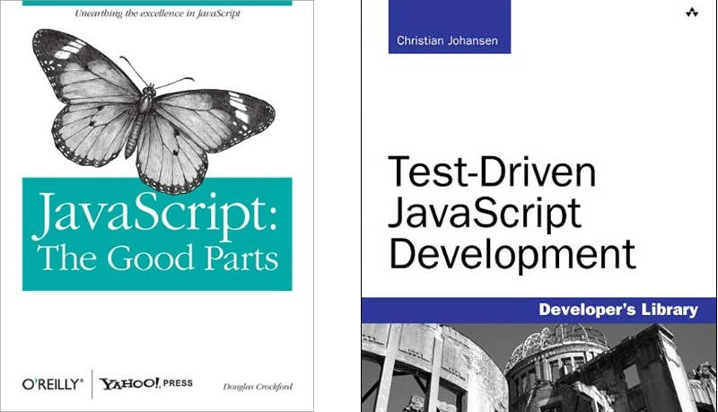

# Resources

* [Named function expressions demystified](http://kangax.github.com/nfe/)
* [Patterns For Large-Scale JavaScript Application Architecture](http://addyosmani.com/largescalejavascript)
* [Core Javascript 1.5 Guide](https://developer.mozilla.org/en/Core_JavaScript_1.5_Guide)
* [Core Javascript 1.5 Reference](https://developer.mozilla.org/en/JavaScript/Reference)
* [Closures for dummies](http://blog.morrisjohns.com/javascript_closures_for_dummies.html)
* [Essential JavaScript Design Patterns For Beginners, Volume 1.](http://www.addyosmani.com/resources/essentialjsdesignpatterns/book/)
* [Douglas Crockford](http://javascript.crockford.com/)
* [JavaScript best practices](http://dev.opera.com/articles/view/javascript-best-practices/)
* [JavaScript Best Practices for Beginners](http://net.tutsplus.com/tutorials/javascript-ajax/24-javascript-best-practices-for-beginners/)
* [The Essentials of Writing High Quality JavaScript](http://net.tutsplus.com/tutorials/javascript-ajax/the-essentials-of-writing-high-quality-javascript/)
* [JSLint](http://www.jslint.com/)
* [JSLint for Visual Studio](http://jslint4vs2010.codeplex.com/)

---

# Resources cont.

* [jQuery API](http://api.jquery.com/)
* [Backbone.js](http://documentcloud.github.com/backbone/)
* [Backbone.js blogging](http://lostechies.com/derickbailey/category/backbone/)
* [Backbone.js modelbinding](https://github.com/derickbailey/backbone.modelbinding)
* [Underscore.js](http://documentcloud.github.com/underscore/)
* [Buster.js](http://busterjs.org/)
* [Sinon.js](http://sinonjs.org)

---

# Books

